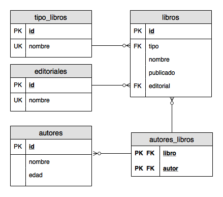

Autores
=======

- Los autores redactan los libros solos, o acompañados por otro autores.

- Los autores gustan de trabajar en varios libros al mismo tiempo.

- Los autores registran sus libros al iniciar la redaccion, incluso sin contrato con la editorial.

- Un autor es considerado como tal, cuando su libro es publicado por alguna editorial.

- Solo es posible publicar a traves de alguna editorial, la cual posee derechos intransferibles sobre la obra.

---

# Responder:

1. ¿Cuales son los libros con la mayor cantidad de autores?

1. ¿Es mas comun que los autores publiquen solos, de a 2-3 autores, o de a muchos mas?

1. ¿Cual es la editorial que mas libros publico?

1. ¿Cual es la editorial con mas autores redactando libros?

1. ¿Que escritores estan trabajando en publicar su primer libro?

1. ¿Cuantos autores NO publicaron Novelas?

1. ¿Cual es el genero con mas publicaciones?

1. ¿Existe algun genero sin ningun libros publicado?

1. ¿Cuales son los autores que NO publicaron Policiales?

1. ¿Cuales son los autores que publicaron con la mayor cantidad de editoriales?

1. De los autores que NO publicaron con Bravo-Loya, ¿trabajaron algun amigo que SI publico con Bravo-Loya?
