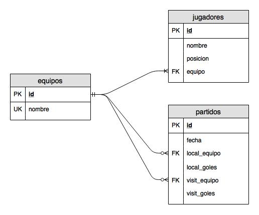

Futbol
======

- Los jugadores solo podran jugar en un unico equipo. 

- Los equipos deberan presentar el listado de jugadores al inciar el campeonato. No se aceptaran cambios.

- Se podran jugar partidos de practica, presentando dos equipos: local y visitante.

# Reglas:

**Posiciones**:

|  Pos.  | Tipo      |
| ------ | --------- |
|   1    | Arquero   |
| 2 -  4 | Defensor  |
| 5 -  8 | Central   |
| 9 - 11 | Delantero |

---

**Puntos**:

| Resultado | Puntos |
| --------- | ------ |
| Ganador   |  +3    |
| Empate    |  +1    |
| Perdedor  |   0    |

---

**Tabla**:

Tabla de ejemplo. Dado los siguientes partidos:

    A-B : 1-0
    A-D : 2-2
    B-D : 4-1

__Donde__:

    PJ: Partido Jugado
    PG: Partido Ganado
    PE: Partido Empatado
    PP: Partido Perdido
    DG: Diferencia Goles
    Ps: Puntos

__Posiciones__:

| Equipo | PJ | PG | PE | PP | DG | Ps |
| ------ | -- | -- | -- | -- | -- | -- |
| Eq A   |  2 |  1 |  1 |  0 | +1 |  4 |
| Eq B   |  2 |  1 |  0 |  1 | +3 |  3 |
| Eq D   |  2 |  0 |  1 |  1 | -3 |  1 |

---

# Responder:

1. ¿Cual es el equipo con la mayor cantidad de jugadores?

1. ¿Cual es la posicion mas popular?

1. ¿Cual es el equipo que mas partidos de practica jugo?

1. En partidos oficiales, ¿cual es el equipo con mayor cantidad de goles?

1. En partidos oficiales, ¿ser local tiene alguna ventaja en el resultado?

1. ¿Cuantos partidos terminaron empate?

1. ¿Cuantos partidos se jugaron el mismo dia?

1. Realizar la tabla de posiciones

1. ¿Se jugaron mas partidos de mañana, tarde, o de noche?
